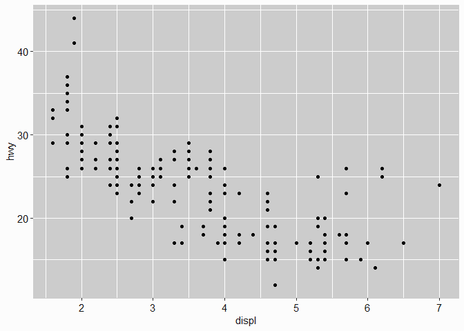
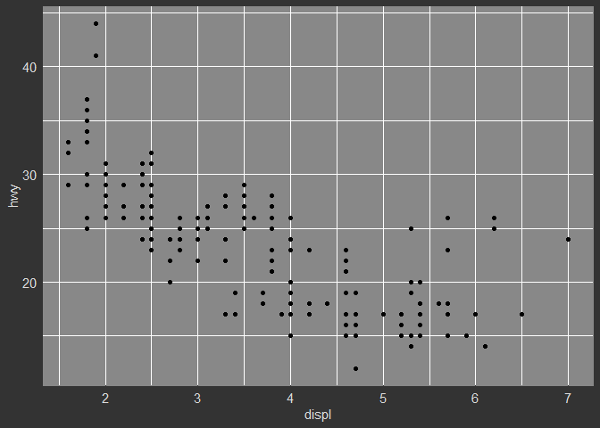
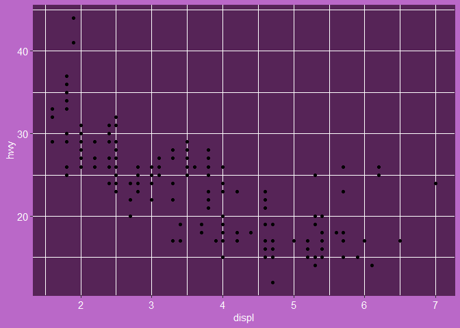

slumstyle
================
Danielle Navarro
14 April 2019

[](https://travis-ci.org/djnavarro/slumstyle)

An R package to accompany the [slum theme for
blogdown](https://github.com/djnavarro/hugo-slum).

``` r
# devtools::install_github("djnavarro/slumstyle")
library("slumstyle")
```

At present it contains only one function `theme_slum()` which provides
ggplot2 themes that are consistent with the different slum colour
schemes.

``` r
library(ggplot2)
p <- ggplot(mpg, aes(displ, hwy)) + geom_point()
p + theme_slum("light")
```

<!-- -->

``` r
p + theme_slum("dark")
```

<!-- -->

``` r
p + theme_slum("kunoichi")
```

<!-- -->
