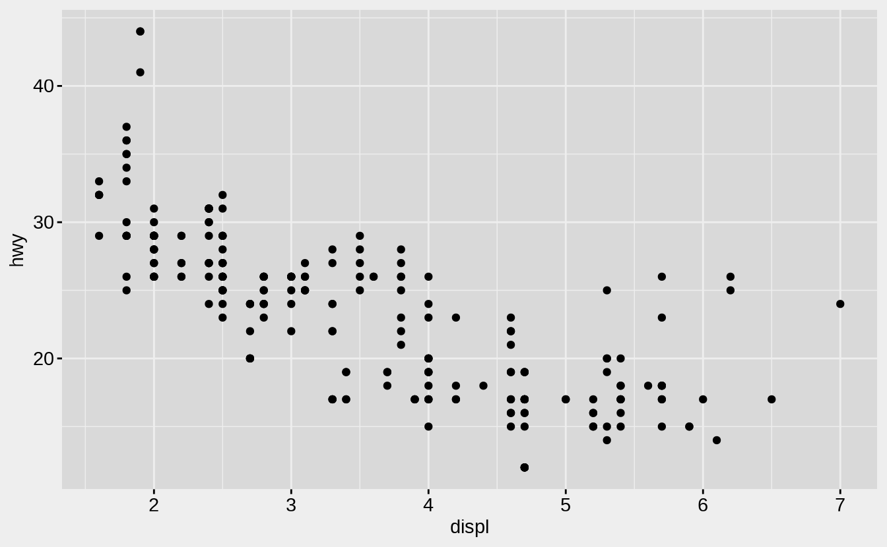

The slum theme allows some degree of flexibility in visual styling, which is really nice when blogging. Most of the time I want my blog to use a consistent palette, but then there are occasions where I might want a single page to use a different colour scheme, and I don't want to have to fiddle with low level settings to do that.

A slum page is defined by five colours that you can specify across the whole site within the `config.toml` file. For this site, the dark theme I have used is defined by the following lines:

    colorPage = "#333333"    # background colour
    colorText = "#dddddd"    # main text colour
    colorFade = "#888888"    # faded text colour
    colorAccent1 = "#ff69b4" # first accent colour ("highlight")
    colorAccent2 = "#ba68c8" # second accent colour ("lowlight")

If you want to change the colour scheme of your entire site, edit these lines in `config.toml`. However, there can be occasions when you wish to customise the colour scheme for a single page only. To do this, specify the colour parameters in the YAML header for your R markdown post. For example, to create the lighter theme in this post the YAML header includes the following lines:

    colorPage: "#eeeeee"
    colorText: "#111111"
    colorFade: "#999999"
    colorAccent1: "#0000dd"
    colorAccent2: "#8a2be2"

Theme-consistent plots
----------------------

One thing that has sometimes been a frustration for me when generating websites using R markdown is the visual styling of plots, which do not necessarily adopt the same colour scheme as the website. To illustrate, suppose I want to generate a plot using ggplot2, and I include code like this:

<pre class='chroma'><code class='language-r' data-lang='r'><a href='https://rdrr.io/r/base/library.html'>library</a>(<a href='http://ggplot2.tidyverse.org'>ggplot2</a>)
<a href='https://ggplot2.tidyverse.org/reference/ggplot.html'>ggplot</a>(mpg, <a href='https://ggplot2.tidyverse.org/reference/aes.html'>aes</a>(displ, hwy)) + <a href='https://ggplot2.tidyverse.org/reference/geom_point.html'>geom_point</a>() 
</code></pre>

This doesn't look *too* terrible, but the pure white background is jarring. What I would prefer is to have the plot background blend into the website background. When I first wrote slumdown I came up with my own system that allowed me to do this, but recently a better option has become available via the [thematic](https://github.com/rstudio/thematic/) package. To set the background colour of my plots to the same colour as my page (i.e., `#eeeeee`), what I would do is this:

<pre class='chroma'><code class='language-r' data-lang='r'><a href='https://rdrr.io/r/base/library.html'>library</a>(<a href='https://rstudio.github.io/thematic'>thematic</a>)
<a href='https://rdrr.io/pkg/thematic/man/thematic.html'>thematic_on</a>(bg = "#eeeeee")
<a href='https://ggplot2.tidyverse.org/reference/ggplot.html'>ggplot</a>(mpg, <a href='https://ggplot2.tidyverse.org/reference/aes.html'>aes</a>(displ, hwy)) + <a href='https://ggplot2.tidyverse.org/reference/geom_point.html'>geom_point</a>() 
</code></pre>

See the documemntation for thematic for more detail.

Custom headers and profiles
---------------------------

The slum theme allows you to customise the header at the top of each page, by modifying the yaml at the top of the post. There are three fields you can customise: `image` provides the path to the header image (relative to the `static/` folder), `caption` is the caption text shown floating over the bottom right of the header image, and the `profile` picture that appears in the middle of the header. All three are optional, and if those fields are not included, then no image (or text) will appear. The relevant lines in the yaml for this post are:

    header:
      caption: "A customised header"
      image: 'header/custom_banner.png'
      profile: 'header/custom_profile.png'

The header image is scaled to fit the width of the page but otherwise left as is, so if you want a different aspect ratio to the one I have used in this site (e.g., to take up less vertical space), the simplest way to do so is to edit the image file itself. The profile image is locked to the center of the banner image, and is scaled to be 70% of the height of the header.

It is important to note that the description above only pertains to posts and projects. For the home page and other automatically generated pages, no caption is included, and the image and profile are set within the `config.toml` file. Specifically, the following two lines underneath the `[params]` section are used to set the images for those pages:

    siteHeader = "header/banner.png"
    siteProfile = "header/profile.png"

