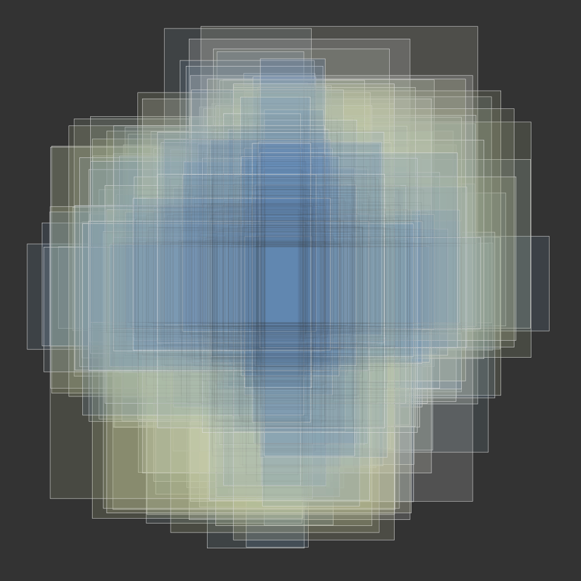

Projects are no different to blog posts in slumdown. They're formatted the same way, generated the same way, and so on. The only difference is that they're indexed separately. This is sometimes useful for separating casual blog posts from more substantive projects.

<pre class='chroma'><code class='language-r' data-lang='r'><a href='https://rdrr.io/r/base/library.html'>library</a>(<a href='https://github.com/thomasp85/scico'>scico</a>)
<a href='https://rdrr.io/r/base/library.html'>library</a>(<a href='https://tibble.tidyverse.org'>tibble</a>)
<a href='https://rdrr.io/r/base/library.html'>library</a>(<a href='https://dplyr.tidyverse.org'>dplyr</a>)
<a href='https://rdrr.io/r/base/library.html'>library</a>(<a href='http://ggplot2.tidyverse.org'>ggplot2</a>)</code></pre>

In this post I'll create a simple generative art system, one that is loosely based on computational model that I use in my everyday research. The main purpose for including it here, however, is to illustrate what the syntax highlighting looks like using the current CSS settings. At the moment it is a little crude, but I'll aim to refine this. Note that this may look different depending on whether the site is generated in hugodown or blogdown!

To get started, I'll define a function that return parameters specifying the art:

<pre class='chroma'><code class='language-r' data-lang='r'>parameters &lt;- function(seed, samples = 100000, plot_range = 7.5,
                       train_range = 2, train_size = 3) {
  <a href='https://rdrr.io/r/base/list.html'>list</a>(
    seed = seed,
    samples = samples,
    plot_range = plot_range,
    train_range = train_range,
    train_size = train_size
  )
}</code></pre>

The next step is to generate the data to be visualised. In this case the data correspond to a set of rectangles that (in the original cognitive science context) would correspond to a collection of possible hypotheses about the extension of a novel category in a two dimensional stimulus space. Rectangles will be shaded on the basis of their size. To that end I'll define a `generator()` function:

<pre class='chroma'><code class='language-r' data-lang='r'>generator &lt;- function(params) {
  
  <a href='https://rdrr.io/r/base/Random.html'>set.seed</a>(params$seed)
  
  train &lt;- <a href='https://rdrr.io/r/base/with.html'>with</a>(params, <a href='https://tibble.tidyverse.org/reference/tibble.html'>tibble</a>(
    x = <a href='https://rdrr.io/r/stats/Uniform.html'>runif</a>(train_size, min = -train_size/2, max = train_size/2),
    y = <a href='https://rdrr.io/r/stats/Uniform.html'>runif</a>(train_size, min = -train_size/2, max = train_size/2)
  ))
  
  train_with &lt;- function(hypotheses, train) {
    n &lt;- <a href='https://rdrr.io/r/base/nrow.html'>nrow</a>(train)
    for(i in 1:n) {
      hypotheses &lt;- hypotheses %&gt;% 
        <a href='https://dplyr.tidyverse.org/reference/filter.html'>filter</a>(
          x_min &lt; train$x[i], x_max &gt; train$x[i], 
          y_min &lt; train$y[i], y_max &gt; train$y[i]
        )
    }
    <a href='https://rdrr.io/r/base/function.html'>return</a>(hypotheses)
  }
  
  hypotheses &lt;- <a href='https://rdrr.io/r/base/with.html'>with</a>(params, <a href='https://tibble.tidyverse.org/reference/tibble.html'>tibble</a>(
    mid_x = <a href='https://rdrr.io/r/stats/Uniform.html'>runif</a>(samples, min = -plot_range, max = plot_range), 
    mid_y = <a href='https://rdrr.io/r/stats/Uniform.html'>runif</a>(samples, min = -plot_range, max = plot_range),
    len_x = <a href='https://rdrr.io/r/stats/GammaDist.html'>rgamma</a>(samples, rate = .5, shape = 1),
    len_y = <a href='https://rdrr.io/r/stats/GammaDist.html'>rgamma</a>(samples, rate = .5, shape = 1)
  )) %&gt;%
    <a href='https://dplyr.tidyverse.org/reference/mutate.html'>mutate</a>(
      x_min = mid_x - len_x / 2, 
      x_max = mid_x + len_x / 2,
      y_min = mid_y - len_y / 2,
      y_max = mid_y + len_y / 2
    ) %&gt;%
    train_with(train) %&gt;%
    <a href='https://dplyr.tidyverse.org/reference/filter.html'>filter</a>( 
      x_min &gt; -params$plot_range, 
      x_max &lt;  params$plot_range,
      y_min &gt; -params$plot_range, 
      y_max &lt;  params$plot_range
    )
  <a href='https://rdrr.io/r/base/function.html'>return</a>(hypotheses)
}</code></pre>

Now that we have a function that generates the data we need a function that will make a pretty plot from the data. This can be done in many ways, but I like ggplot2 so I'll use that:

<pre class='chroma'><code class='language-r' data-lang='r'>plotter &lt;- function(hypotheses) {
  
  pal &lt;- <a href='https://rdrr.io/r/base/sample.html'>sample</a>(<a href='https://rdrr.io/pkg/scico/man/scico_data.html'>scico_palette_names</a>(), 1)
  bg &lt;- "#333333";
  r &lt;- <a href='https://rdrr.io/r/base/Extremes.html'>max</a>(
    hypotheses$y_max,
    hypotheses$x_max, 
    -hypotheses$y_min,
    -hypotheses$x_min
  )
  
  picture &lt;- <a href='https://ggplot2.tidyverse.org/reference/ggplot.html'>ggplot</a>(
    data = hypotheses, 
    mapping = <a href='https://ggplot2.tidyverse.org/reference/aes.html'>aes</a>(xmin = x_min, ymin = y_min, 
                  xmax = x_max, ymax = y_max)
  ) + 
    <a href='https://ggplot2.tidyverse.org/reference/geom_tile.html'>geom_rect</a>(<a href='https://ggplot2.tidyverse.org/reference/aes.html'>aes</a>(fill = len_x + len_y), 
              alpha = .15, color = "white", 
              size = .1, show.legend = FALSE) + 
    
    <a href='https://ggplot2.tidyverse.org/reference/geom_tile.html'>geom_rect</a>(fill = NA, color = <a href='https://rdrr.io/r/base/paste.html'>paste0</a>(bg, "22"), 
              size = .1, show.legend = FALSE) + 
    
    # stylistic
    <a href='https://ggplot2.tidyverse.org/reference/ggtheme.html'>theme_void</a>() +
    <a href='https://ggplot2.tidyverse.org/reference/theme.html'>theme</a>(plot.background = <a href='https://ggplot2.tidyverse.org/reference/element.html'>element_rect</a>(fill = bg, colour = bg)) + 
    <a href='https://ggplot2.tidyverse.org/reference/scale_continuous.html'>scale_x_continuous</a>(NULL, labels = NULL, limits = <a href='https://rdrr.io/r/base/c.html'>c</a>(-r, r)) + 
    <a href='https://ggplot2.tidyverse.org/reference/scale_continuous.html'>scale_y_continuous</a>(NULL, labels = NULL, limits = <a href='https://rdrr.io/r/base/c.html'>c</a>(-r, r)) + 
    scico::<a href='https://rdrr.io/pkg/scico/man/ggplot2-scales.html'>scale_fill_scico</a>(palette = pal) +
    <a href='https://ggplot2.tidyverse.org/reference/coord_fixed.html'>coord_equal</a>() 
  
  <a href='https://rdrr.io/r/base/function.html'>return</a>(picture)
}</code></pre>

Here are a few images generated from this system, varying only the `seed` parameter:

<pre class='chroma'><code class='language-r' data-lang='r'>thematic::<a href='https://rdrr.io/pkg/thematic/man/thematic.html'>thematic_on</a>(bg = "#333333")
1 %&gt;% parameters() %&gt;% generator() %&gt;% plotter()
</code></pre>

<pre class='chroma'><code class='language-r' data-lang='r'>2 %&gt;% parameters() %&gt;% generator() %&gt;% plotter()
</code></pre>

<pre class='chroma'><code class='language-r' data-lang='r'>3 %&gt;% parameters() %&gt;% generator() %&gt;% plotter()
</code></pre>

<pre class='chroma'><code class='language-r' data-lang='r'>4 %&gt;% parameters() %&gt;% generator() %&gt;% plotter()
</code></pre>

<pre class='chroma'><code class='language-r' data-lang='r'>5 %&gt;% parameters() %&gt;% generator() %&gt;% plotter()
</code></pre>

